# AIDevFlow SaaS — Architecture Design

## Overview

AIDevFlow is a **compiler + coordination layer** for AI-powered software development workflows. It compiles tenant-designed workflows into GitHub Actions or GitLab CI pipelines, coordinates human gates and service calls centrally, and tracks run state — but never executes code itself. Execution always happens on the tenant's own runners.

This document covers: system components, GCP infrastructure, tech stack decisions, cost estimates, and deployment topology.

---

## System Architecture

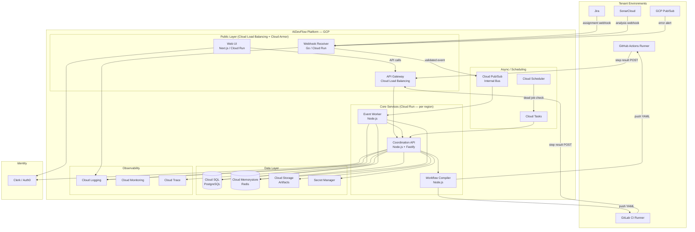

---

## Service Breakdown

### 1. Web UI — Next.js

The tenant-facing dashboard: workflow designer, run trace, task library, admin config.

**Why Next.js:**
- App Router with React Server Components for fast initial load
- API routes for BFF (backend-for-frontend) pattern — avoids exposing Coordination API directly to browser
- SSR for the marketing/pricing pages (SEO)
- Static export for the dashboard shell (CDN-cacheable)

**Hosting:** Cloud Run (containerised) behind Cloud CDN. Firebase Hosting is an alternative but Cloud Run gives more control over headers and auth middleware.

**Auth:** Clerk SDK for Next.js — handles login, SSO federation, MFA, session tokens. Zero auth code to write.

---

### 2. Webhook Receiver — Go

The only public-facing inbound endpoint. Receives webhooks from Jira, SonarCloud, GCP Pub/Sub push subscriptions, and generic HTTP callers.

**Why Go (not Node.js):**
- Stateless, high-throughput, latency-sensitive — Go is significantly faster and uses less memory than Node.js for this workload
- Small Docker images (~10MB vs ~150MB for Node)
- Cheap on Cloud Run: Go handles more concurrent requests per instance
- No shared code needed with the rest of the platform at runtime — just validates and publishes

**Responsibilities:**
- Validate webhook signatures (Jira HMAC-SHA256, SonarCloud secret, GCP Pub/Sub JWT)
- Check webhook URL token (unguessable UUID in path)
- Rate limit per tenant (Redis counter)
- Deduplicate events (Redis set with 5-minute TTL)
- Publish validated, structured event to Cloud Pub/Sub internal topic
- Return 200 immediately — never block on downstream processing

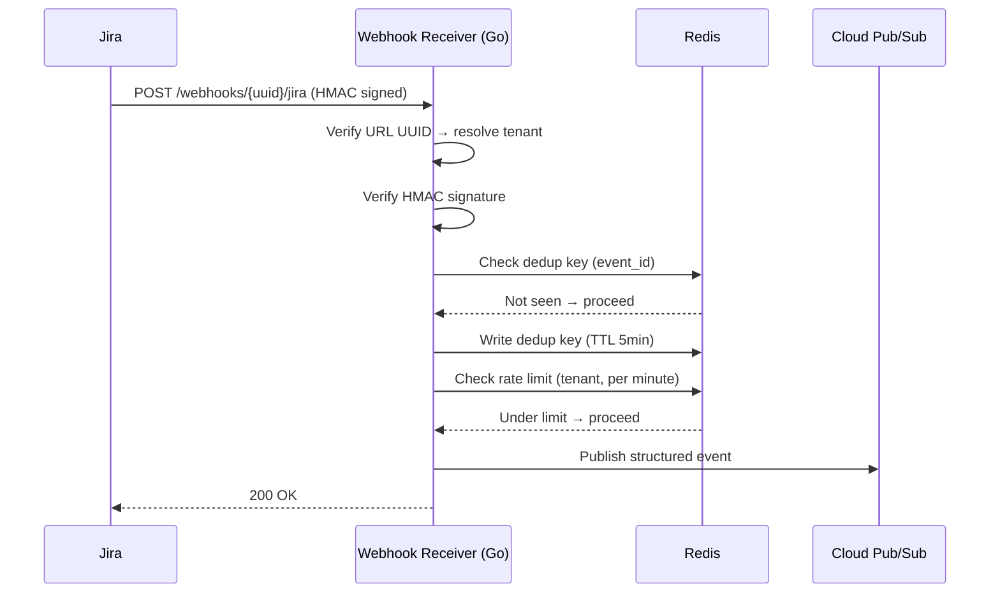

---

### 3. Coordination API — Node.js + Fastify

The brain of the platform. Handles all state, secrets, service proxying, and human gate management.

**Why Fastify over Express:**
- 2× faster throughput (benchmarked)
- First-class TypeScript support
- Plugin ecosystem (auth, rate limit, schema validation) is cleaner
- Built-in JSON schema validation with Ajv (fast, type-safe)

**Why Node.js over Go here:**
- Shared TypeScript types with the Web UI and Compiler (monorepo)
- Prisma ORM for PostgreSQL — excellent DX, type-safe queries, migration management
- BullMQ job queue (Redis-backed) — fits naturally in Node
- The Coordination API is IO-bound (DB reads, secret fetches, external API calls) — Node's async model is ideal

**Key responsibilities:**
- Authenticate runner requests (`AIDEVFLOW_TENANT_TOKEN` → `tenant_api_tokens` lookup)
- Persist step results, outputs, run state (`pipeline_run_steps`, `task_executions`)
- Proxy service calls: Jira, SonarCloud, GitHub (fetching secrets from Secret Manager at call time)
- Human gate open/close + notification dispatch
- Dry run enforcement (reject write-type callbacks during dry runs)
- Token rotation (re-provision secrets to GitHub/GitLab via their APIs)
- AIDEVFLOW_TENANT_TOKEN validation: constant-time HMAC comparison against stored hash

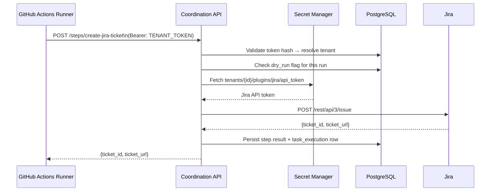

---

### 4. Workflow Compiler — Node.js

Converts tenant workflow YAML into GitHub Actions or GitLab CI YAML, pushes it to the repo, provisions runner secrets, and maintains the `repo_skill_manifests` table.

**Runs as:** a separate Cloud Run service called by the Coordination API (or as a library within it — start as a library, extract when needed).

**Key operations:**
- Parse workflow YAML (js-yaml)
- Resolve task library entries, skill versions
- Generate target CI/CD YAML (GitHub Actions jobs or GitLab CI stages)
- Compile skill YAML → `.claude/skills/SKILL.md` or `.agents/skills/SKILL.md`
- Push files to repo via GitHub App installation token (scoped to specific repo) or GitLab token
- Provision `AIDEVFLOW_TENANT_TOKEN` and AI provider key as runner secrets via GitHub/GitLab API
- Run deploy-time validation (runner label warning, required plugins present, `return_assignee` valid)
- Diff `repo_skill_manifests` and delete orphaned skill files

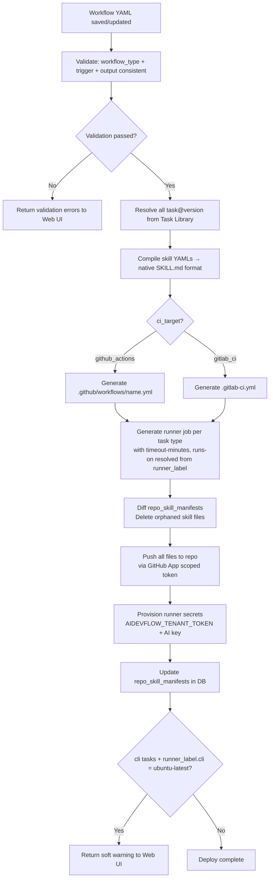

---

### 5. Event Worker — Node.js

Subscribes to Cloud Pub/Sub internal topics. Translates validated webhook events into workflow run triggers.

**Responsibilities:**
- Pull from `aidevflow.internal.events` Pub/Sub subscription
- Resolve tenant from event (webhook UUID → `tenant_plugins`)
- Map event type → workflow (`tenant_system_users` for Jira assignments, `repo_registry` for SonarCloud)
- Check concurrency: is there an active run for `(tenant_id, workflow_id, ticket_id)`?
  - If yes: post Jira comment via Coordination API, ack message, done
  - If no: create `pipeline_runs` row, dispatch trigger to CI/CD via `repository_dispatch` (GitHub) or pipeline trigger API (GitLab)
- Ack Pub/Sub message only after successful dispatch

---

### 6. Scheduled Jobs — Cloud Scheduler + Cloud Run Jobs

| Job | Schedule | What it does |
|---|---|---|
| Dead job detector | Every 5 min | Marks steps stuck in `running` beyond timeout as `failed`; notifies tenant |
| Trial expiry check | Daily 00:00 UTC | Suspends tenants whose `trial_ends_at` has passed |
| Offboarding cleanup | Daily 01:00 UTC | Runs hard delete for tenants 30 days past suspension |
| Token rotation reminder | Weekly | Alerts tenants whose API tokens haven't been rotated in 90 days |

---

## Multi-Region Topology

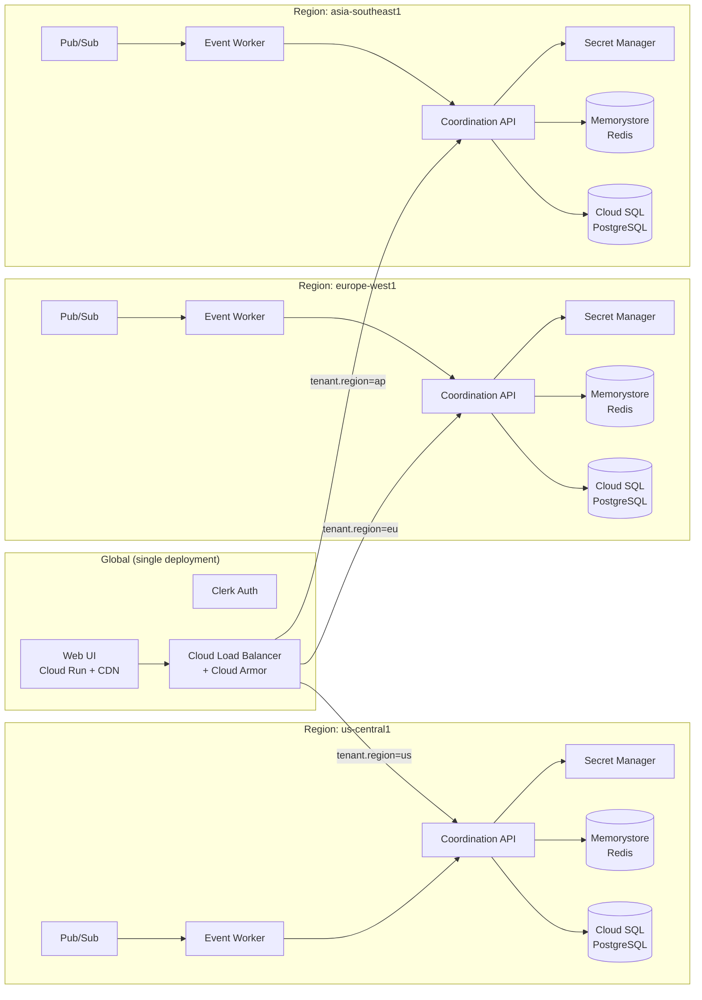

**Region selection:** tenant's region is encoded in `AIDEVFLOW_TENANT_TOKEN`. The Cloud Load Balancer uses URL-based routing: the token is passed in the `Authorization` header, but a lightweight auth sidecar (or the GLB itself via header inspection) routes to the correct regional backend. Simpler alternative: use regional subdomains (`api-eu.aidevflow.io`, `api-us.aidevflow.io`) — the Web UI calls the correct subdomain after login.

---

## Data Flow: Jira-Triggered Workflow

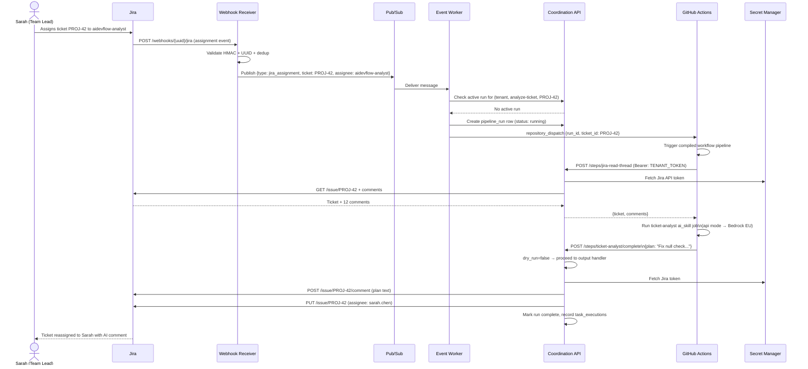

---

## Tech Stack

### Recommended Stack

| Layer | Technology | Why |
|---|---|---|
| **Frontend** | Next.js 15 (TypeScript) | App Router, RSC, Clerk integration, SSR for marketing |
| **UI Components** | shadcn/ui + Tailwind CSS | Accessible, composable, no runtime overhead |
| **Client state** | Zustand | Lightweight, TypeScript-first |
| **Data fetching** | TanStack Query | Server state, caching, optimistic updates |
| **Coordination API** | Fastify 5 (Node.js, TypeScript) | 2× faster than Express; JSON schema validation built-in |
| **Webhook Receiver** | Go 1.23 (Chi router) | High throughput, tiny memory footprint, small image |
| **ORM** | Prisma 6 | Type-safe queries, migration management, RLS support |
| **Job queue** | BullMQ (Redis-backed) | Reliable, retry logic, delayed jobs |
| **YAML parsing** | js-yaml | Parse workflow YAML; generate CI/CD YAML |
| **Auth** | Clerk | OIDC/SSO, MFA, Next.js SDK, zero auth code |
| **Database** | PostgreSQL 16 (Cloud SQL) | RLS, JSONB for config fields, mature, managed |
| **Cache / queue** | Redis 7 (Cloud Memorystore) | BullMQ backend, rate limiting, deduplication |
| **Secret store** | GCP Secret Manager | Per-tenant IAM scoping, audit logs, versioning |
| **Event bus** | GCP Cloud Pub/Sub | Push subscriptions, at-least-once delivery, regional |
| **Monorepo** | Turborepo | Shared packages (types, db schema, skill templates) |
| **Infra as code** | Terraform | GCP resources, per-region modules |
| **Containerisation** | Docker + Artifact Registry | Cloud Run deployments |
| **CI/CD (platform itself)** | Cloud Build | Build, test, push images |

### Alternative Languages Considered

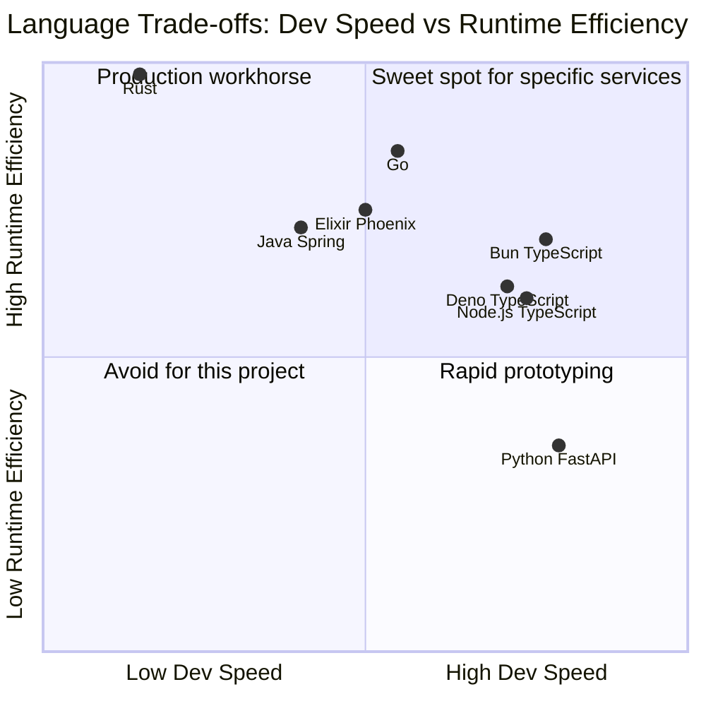

**Node.js (TypeScript) — primary language for Coordination API, Compiler, Worker**
- Monorepo with Web UI — shared types, shared Prisma client, shared YAML schemas
- IO-bound workload (DB reads, secret fetches, external API calls) — Node is ideal
- Largest ecosystem of npm packages for the integrations needed
- Fastify provides enough performance overhead; horizontal scaling on Cloud Run handles load

**Go — Webhook Receiver only**
- Stateless, high-throughput, latency-critical
- Ideal for HMAC validation + Pub/Sub publish under load
- 10MB Docker image vs 150MB for Node
- No shared code needed with the TypeScript codebase at runtime

**Bun — future consideration**
- Drop-in Node.js replacement, 3-4× faster startup (important for Cloud Run cold starts)
- Built-in TypeScript transpilation, no `ts-node` needed
- Not yet production-battle-tested for all npm packages — adopt in 12 months when ecosystem is more stable

**Elixir/Phoenix — considered for real-time (WebSocket) features**
- Phoenix Channels are excellent for the Run Dashboard live updates
- But: adds a second language to the backend team; Phoenix LiveView covers most real-time needs without WebSockets
- Decision: use Server-Sent Events (SSE) from Fastify for live run updates instead — simpler, works with Cloud Run

**Python (FastAPI) — rejected**
- GIL is a liability for concurrent webhook handling
- Slower cold starts than Node on Cloud Run
- No shared types with TypeScript frontend

**Rust — rejected for v1**
- Development velocity too slow for a startup finding product-market fit
- Revisit for the Workflow Compiler once the YAML schema is stable and performance becomes a bottleneck

---

## Monorepo Structure

```
aidevflow/
├── apps/
│   ├── web/                    # Next.js 15 — Web UI
│   │   ├── app/                # App Router pages
│   │   ├── components/         # shadcn/ui components
│   │   └── middleware.ts       # Clerk auth middleware
│   │
│   ├── api/                    # Fastify — Coordination API
│   │   ├── src/
│   │   │   ├── routes/         # /runs, /steps, /human-gate, /tokens
│   │   │   ├── services/       # JiraService, GitHubService, SecretService
│   │   │   ├── workers/        # BullMQ job handlers
│   │   │   └── plugins/        # Fastify plugins (auth, rate-limit, cors)
│   │   └── Dockerfile
│   │
│   ├── webhook-receiver/       # Go — inbound webhook handler
│   │   ├── internal/
│   │   │   ├── handlers/       # jira.go, sonarcloud.go, pubsub.go
│   │   │   ├── validator/      # HMAC verification
│   │   │   └── publisher/      # Pub/Sub client
│   │   └── Dockerfile
│   │
│   └── compiler/               # Node.js — Workflow → CI/CD YAML
│       ├── src/
│       │   ├── parsers/        # Parse workflow YAML
│       │   ├── generators/     # github-actions.ts, gitlab-ci.ts
│       │   ├── skill-compiler/ # Platform skill YAML → SKILL.md
│       │   └── deployer/       # Push to repo, provision secrets
│       └── Dockerfile
│
├── packages/
│   ├── types/                  # Shared TypeScript types (workflow, task, skill schemas)
│   ├── db/                     # Prisma schema, migrations, seed data
│   │   ├── schema.prisma
│   │   └── migrations/
│   ├── skill-library/          # Built-in skill YAML files (versioned)
│   │   └── skills/
│   │       ├── code-implementer/1.0.0.yaml
│   │       ├── ticket-analyst/1.0.0.yaml
│   │       └── ...
│   └── workflow-templates/     # Global workflow templates (versioned)
│       └── templates/
│           ├── report-error/1.0.0.yaml
│           ├── analyze-ticket/1.0.0.yaml
│           └── ...
│
├── infra/
│   ├── terraform/
│   │   ├── modules/
│   │   │   ├── region/         # Cloud Run, Cloud SQL, Redis, Pub/Sub per region
│   │   │   └── global/         # Load Balancer, Cloud Armor, Artifact Registry
│   │   ├── us.tf
│   │   ├── eu.tf
│   │   └── ap.tf
│   └── cloudbuild/             # Cloud Build pipeline configs
│
└── turbo.json                  # Turborepo pipeline config
```

---

## GCP Infrastructure Detail

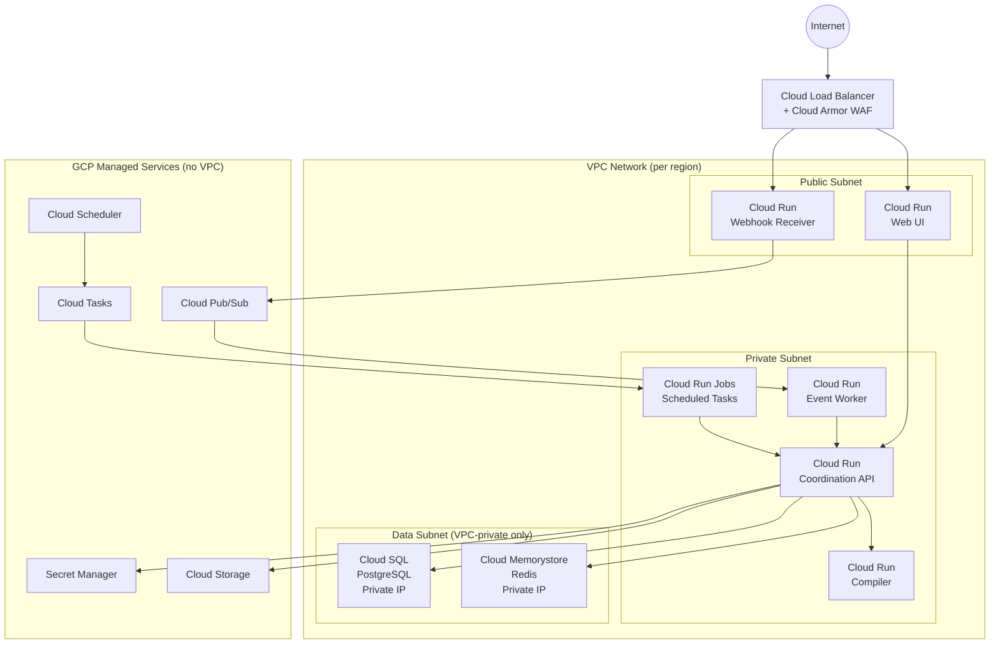

**Key networking decisions:**
- Cloud SQL and Memorystore have **private IPs only** — not reachable from the internet
- Cloud Run services in the private subnet use **VPC connector** to reach private data layer
- Coordination API, Worker, Compiler are **not internet-facing** — all traffic via Load Balancer or internal VPC
- Webhook Receiver and Web UI are the only public-facing Cloud Run services

---

## Cost Estimation

### Assumptions (launch: 50 tenants)

- Mix: 30 Trial/Starter, 15 Pro, 5 Enterprise
- ~500 workflow runs/day, ~3,000 task executions/day
- Average job duration: `api` 30s, `service_call` 20s, `cli` skipped (runs on tenant runners)
- 3 regions active from day 1
- Coordination API: ~0.5 vCPU, 512MB per instance, scales to zero

### Monthly Cost Breakdown

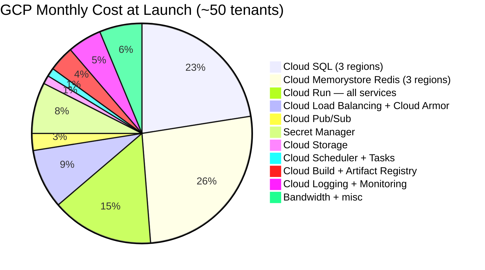

| Component | Config | Monthly Cost (USD) |
|---|---|---|
| **Cloud SQL PostgreSQL** | db-g1-small (1 vCPU, 1.7GB) × 3 regions, HA, 20GB SSD | ~$150 |
| **Cloud Memorystore Redis** | Basic 1GB × 3 regions | ~$105 |
| **Cloud Run — Coordination API** | 0.5 vCPU / 512MB, scales to 0, ~500k requests/month | ~$25 |
| **Cloud Run — Webhook Receiver** | 0.25 vCPU / 256MB (Go — tiny), ~50k webhooks/month | ~$5 |
| **Cloud Run — Compiler** | 1 vCPU / 1GB, on-demand only | ~$10 |
| **Cloud Run — Worker** | 0.5 vCPU / 512MB | ~$10 |
| **Cloud Run — Web UI** | 0.5 vCPU / 512MB + CDN | ~$15 |
| **Cloud Load Balancing** | 1 global rule + backend services | ~$20 |
| **Cloud Armor** | Standard policy | ~$10 |
| **Cloud Pub/Sub** | ~1GB messages/month | ~$5 |
| **Secret Manager** | ~500 secrets, 10k accesses/day | ~$30 |
| **Cloud Storage** | 10GB artifacts | ~$3 |
| **Cloud Scheduler** | 4 jobs | ~$1 |
| **Cloud Build** | ~60 build minutes/day | ~$15 |
| **Artifact Registry** | ~5GB images | ~$5 |
| **Cloud Logging + Monitoring** | ~50GB logs/month | ~$25 |
| **Bandwidth** | Egress ~100GB/month | ~$12 |
| **TOTAL** | | **~$496/month** |

### Cost at Scale

| Tenants | Task executions/day | Est. monthly infra cost | Revenue (avg $100/tenant) | Margin |
|---|---|---|---|---|
| 50 | 3,000 | ~$500 | ~$2,500 | 80% |
| 200 | 12,000 | ~$1,200 | ~$20,000 | 94% |
| 500 | 30,000 | ~$2,500 | ~$75,000 | 97% |
| 2,000 | 120,000 | ~$8,000 | ~$300,000 | 97% |

Cloud Run scales to zero — idle tenants cost nothing. The dominant cost is Cloud SQL (fixed per region regardless of load). At 500+ tenants consider moving to **AlloyDB** or **Cloud SQL Enterprise** for better performance; cost increases by ~2× but handles 10× the load.

**Clerk Auth pricing:** ~$0.02/active user/month. At 50 tenants × 10 users = 500 users = ~$10/month. Scales linearly. Switch to Clerk Enterprise ($1,000+/month) if tenants need custom SSO at scale.

---

## Database Schema (Key Relationships)

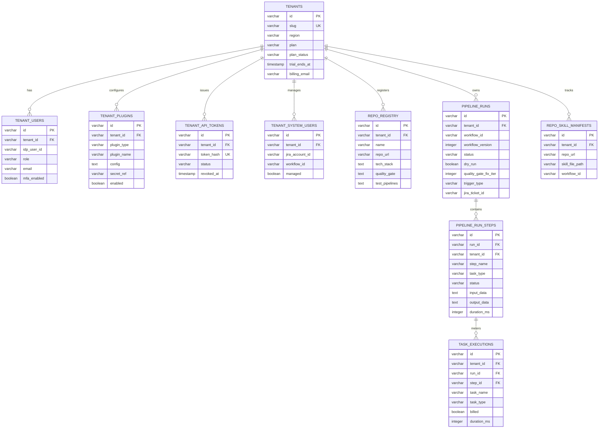

---

## Deployment Pipeline

```mermaid
flowchart LR
    DEV[Developer\npushes to main] --> CB[Cloud Build\ntriggered]
    CB --> TEST[Run tests\nTypeScript + Go]
    TEST --> BUILD[Build Docker images\nper service]
    BUILD --> AR[Push to\nArtifact Registry]
    AR --> DEPLOY_US[Deploy to\nus-central1]
    DEPLOY_US --> SMOKE_US[Smoke test\nUS]
    SMOKE_US --> DEPLOY_EU[Deploy to\neurope-west1]
    DEPLOY_EU --> SMOKE_EU[Smoke test\nEU]
    SMOKE_EU --> DEPLOY_AP[Deploy to\nasia-southeast1]
    DEPLOY_AP --> DONE[Deploy complete]
```

Sequential regional deployment (US → EU → AP) with smoke tests between regions. A failed smoke test rolls back that region via Cloud Run traffic splitting (keep 100% on previous revision until fixed).

---

## Security Architecture

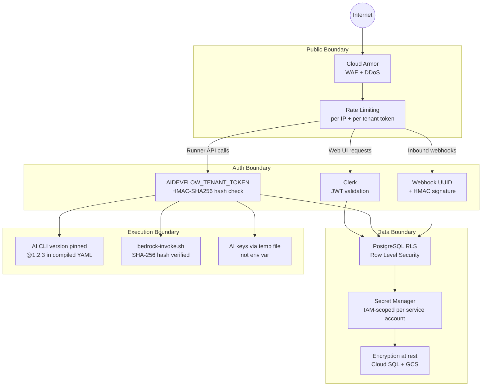

---

## MVP Scope Recommendation

Given the competitive analysis (GitHub Copilot for Jira is advancing rapidly on the GitHub+Jira slice), the MVP should target the GitLab+Jira market first — that's where there's no well-funded competitor.

### MVP (3–4 months)

| Feature | Included |
|---|---|
| Web UI: auth, plugin config, system user setup | ✓ |
| Jira assignment trigger → workflow run | ✓ |
| `jira_analysis` workflow type (analyze-ticket pattern) | ✓ |
| `api` execution tasks only (no `cli` in MVP) | ✓ — simpler, no runner needed for analysis |
| GitLab CI compilation (lead with GitLab) | ✓ |
| GitHub Actions compilation | ✓ |
| Run Trace in Web UI | ✓ |
| EU region | ✓ — leads with GDPR compliance |
| Task Test Panel for `api` tasks | ✓ |
| Trial tier (50 executions, 30 days) | ✓ |

**Excluded from MVP:** `cli` tasks (code-implementer, quality-gate-fixer), SonarCloud webhook, GCP Pub/Sub trigger, skill compilation to SKILL.md format, dry run, multi-region (US+AP added after EU validates).

The MVP proves the Jira-assignment-chaining model works and gets real tenants using `analyze-ticket` + `analyze-implementation` workflows before building the more complex code execution layer.

---

## Brainstorm: What Could Change the Architecture

**If Bun matures (6–12 months):** Replace Node.js with Bun across all TypeScript services. Faster cold starts on Cloud Run (Bun boots in ~50ms vs Node's ~300ms), built-in TypeScript, smaller images. Same ecosystem, near-zero migration cost.

**If Cloud Run volume justifies it:** Move from Cloud SQL `db-g1-small` to **AlloyDB** (Postgres-compatible, 2–4× faster read throughput, columnar engine for analytics queries on run history). Cost: ~3× but handles 10× the concurrent connections.

**If real-time dashboard becomes a bottleneck:** Replace Server-Sent Events with **Cloud Pub/Sub push subscriptions to browser** via a WebSocket proxy (Fastify + `ws`). Or adopt **Elixir Phoenix** for just the real-time gateway — it handles millions of concurrent WebSocket connections cheaply.

**If the Workflow Compiler becomes complex:** Extract into a dedicated service written in **Rust** — the compiler is a pure transformation function (YAML in → YAML out), no IO, no shared state. Rust would make it ~10× faster and completely memory-safe. Worth doing once the YAML schema is stable.

**If multi-region data residency becomes a sales requirement for every enterprise deal:** Consider **Terraform Cloud + multi-region Atlantis** for tenant-specific infrastructure rather than shared regional stacks. Each Enterprise tenant gets their own Cloud Run namespace and Cloud SQL instance. Operational overhead is high — only for Enterprise tier at $1,000+/month.
